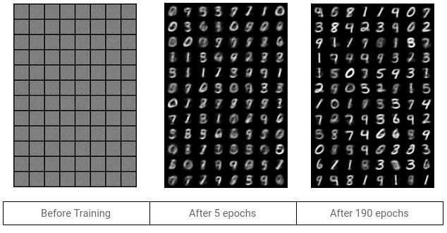
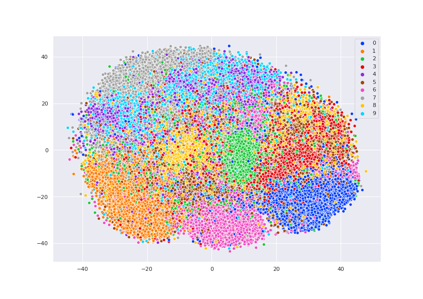
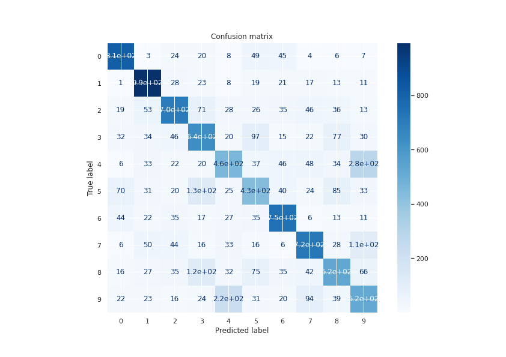

# Variational_Autoencoders

### Training Progress

### Latent Space Visualization

### Confusion Matrix (training SVM on the latent space)

*Question 1 of Assignment 3 of the Deep Learning course*
